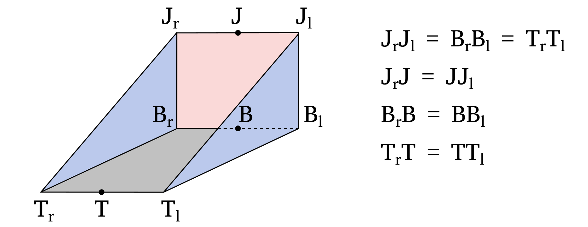

# Documentation for bucket.jl

## General description of the simulated excavator bucket
The excavator's bucket has usually a complex shape that is not suitable for first-order modelling.
In this simulator, the bucket is approximated as a triangular prism to simplify its representation.
An illustration of the simulated bucket is provided below.



The different parts of the bucket are labeled as follows:
- `J` represents the bucket joint.
- `B` represents the bucket base.
- `T` represents the bucket teeth.
- The surface defined by the vertices $T_lT_rB_rB_l$ is referred to as the bucket base.
- The surface defined by the vertices $J_lJ_rB_rB_l$ is referred to as the bucket back.
- The surface defined by the vertices $J_rB_rT_r$ is referred to as the bucket right side.
- The surface defined by the vertices $J_lB_lT_l$ is referred to as the bucket left side.
- The surface defined by the vertices $J_lJ_rT_rT_l$ is referred to as the bucket front. Note that it does not correspond to a bucket wall.

The reference pose of the bucket is specified when creating the `BucketParam` struct and is defined by the fields `j_pos_init`, `b_pos_init`, and `t_pos_init`, which correspond to the positions of the bucket joint, base, and teeth, respectively.
The center of rotation for the bucket is typically the bucket joint, but it can be a different point depending on the specific bucket design.
In that case, a different bucket origin can be provided when building `BucketParam`.
The position of the bucket joint, base, and teeth are generally defined relative to the bucket origin.

The pose of the bucket is provided to the simulator as the Cartesian position of the bucket origin and its orientation relative to the reference pose, using the `Quaternion` notation.

## Determination of the bucket position
The purpose of the functions in this file is to determine the position of the excavator bucket within the 3D grid.
Specifically, it aims to identify, for each XY position in the grid, the minimum and maximum height of the bucket if it is present at that location.
The algorithm used for this task has been optimized for performance, resulting in a highly efficient implementation.
However, due to the optimization, the algorithm may appear complex or unintuitive.

The basic idea under the implementation is to decompose the bucket into its 4 surfaces (base, back, left side, right side), and to identify for each XY position of the grid the minimum and maximum height of the given bucket wall.
The results for the four surfaces are then aggregated, sorted and duplicates are removed.
It is then starightforward to determine for each XY position the minimum and maximum height of the bucket using this information.
Although a different implementation is present for the rectangular surfaces (base and back) and for the triangular surfaces (left and right side), the algorithm is almost identical.

Decomposition of Bucket Surfaces: The bucket is decomposed into its four main surfaces - base, back, left side, and right side. For each XY position in the grid, the algorithm identifies whether it falls within the projection of any of these surfaces onto the horizontal plane. This step helps determine the presence of the bucket wall at a given position.

The position of the bucket wall is determined using a three-steps process:
- (1) Each XY position within the bounding box of the bucket wall is decomposed into the reference vectors of the considered surface.
  This allows to easily determine whether a given XY position falls inside or outside the projection of the bucket wall into the horizontal plane.
- (2) For each XY position (`ii`, `jj`) within the projection of the bucket wall into the horizontal plane, the height of the bucket wall at the cell corner (`ii + 0.5`, `jj + 0.5`) is calculated and added to the tally.
  By iterating over all the cells, the algorithm ensures that the height of the bucket is calculated at the 4 corners of each cell within the projection of the bucket wall into the horizontal plane.
  This is crucial because the minimum and maximum height of a plane intersecting laterally a cell is occuring necesserarily at one of the cell's corner.
- (3) An issue of this algorithm is that it does not handle the case where the bucket wall is either not fully intersecting the cell or intersecting vertically the cell.
  Those cases are handled separately by identifying all the cells where the edges of the bucket wall are located. This is simply done by decomposing each edges into a certain number of equally spaced point, and then determining where each points is located.

## API
```@autodocs
Modules = [SoilDynamics]
Pages   = ["bucket.jl"]
```
