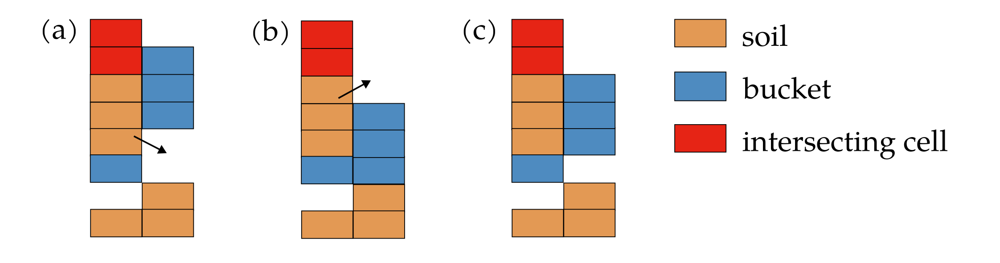
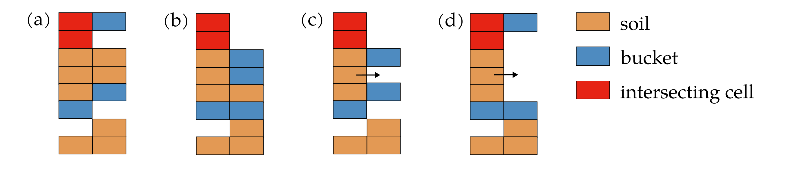
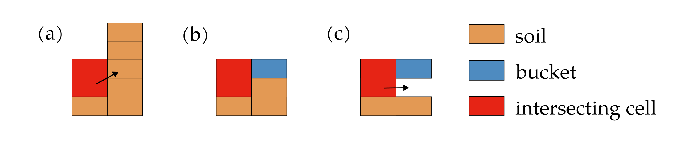

# Documentation for intersecting_cells.jl

## Introductory remarks
After updating the position of the bucket and the soil resting on the bucket, it is possible that some soil cells are located in the same position as a bucket wall, while it is obviously physically impossible to have both soil and the bucket at the same position.
These soil cells are referred to as intersecting cells in the simulator.

The purpose of the functions in this file is to move these soil cells following a set of rules in order to reach a situation that is physically admissible.
This is done in two steps. First, the intersecting soil cells resting on the bucket are moved, then the intersecting soil cells from the terrain are moved.
Note that the order is important because for some conditions the movement of intersecting soil cells resting on the bucket is creating intersecting soil cells in the terrain.

The implementation of these two different steps are described below.

### Movement of soil cells on the bucket intersecting with the bucket
#### General description
One of the eight directions surrounding the intersecting soil cells is chosen randomly and the algorithm investigate whether soil can be moved in that direction.
In that direction, positions of incrementally greater distance from the intersecting soil cells are investigated until either all soil has been moved or a bucket wall is blocking the movement.
If a bucket wall is blocking the movement, another direction is investigated.
In the edge case where all the soil has not been moved after exploring the eight directions, a warning is sent and the soil simply disappears.
However, this edge case should not happen.

Note: 
- The investigated directions are randomized in order to avoid asymmetrical results.
- There are necessarily two bucket layers where the intersecting soil cells are located.

#### Description of the different cases
##### No bucket is present
In that case, the interseting soil cells are simply move to the terrain.

##### One bucket layer
In that case, three different cases illustrated below are possible.


 
(a) In this case, there is a space below the bucket layer and the remaining intersecting soilcells are moved to the terrain.
This is done independently of the space available below the bucket.
If there is no space or not enough space, the soil is still moved and the induced intersecting soil cells will be moved in the following step.

(b) In this case, the intersecting soil cells is moved to the top of the bucket layer.
This is done independently of the presence or not of soil on this bucket layer.

(c) In this case, the bucket layer in the new position is extending over the two bucket layers of the previous position.
This creates a wall preventing the soil movement.
The exploration of this direction is therefore stopped.

Note that in this case the investigation of the considered direction will necessarily stop, either because of the presence of a bucket wall or because all the soil could be moved.
That also means that the previous position has necessarily two bucket layers.

##### Two bucket layers
In that case, four different cases illustrated below are possible.



(a) In this case, the combination of the bucket soil and bottom bucket layer in the new position is extending over the two bucket layers of the previous position.
It is assumed that no soil is moved to this position but the exploration in this direction can still continue.

(b) In this case, soil is fully filling the space between the two bucket layers in the new position.
It is assumed that the exploration in this direction can still continue.

(c) In this case, some space is available between the two bucket layers but not enough for all the intersecting soil cells.
The intersecting soil cells are moved to the available space and the exploration in this direction continues.

(d) In this case, enough space is available between the two bucket layers for all the intersecting soil cells.
The intersecting soil cells are moved to this position.

### Movement of soil cells on the terrain intersecting with the bucket
#### General description
The eight cells surrounding the intersecting soil cells are investigated in a random order to determine if soil can be moved to that position.
If there is insufficient space for all the soil, it incrementally checks the eight directions farther from the intersecting soil column until all the soil has been moved.

Note:
- The investigated directions are randomized in order to avoid asymmetrical results.
- Soil is necessarily moved to the terrain.

#### Description of the different cases
There are only three different cases possible as illustrated below.



(a) In this case, no bucket is present in the new position and all the soil is moved to that position.
This is done even if the bucket is buried deep underground.

(b) In this case, no space is available below the bucket so no movement is made.

(c) In this case, some space is available below the bucket and enough soil is moved to that position in order to fill the gap.

### Concluding remarks

When the simulator will have the ability to handle multiple buckets, it would probably be necessary to handle separately the movement of soil resting on a bucket and intersecting with a different bucket.
It would also be necessary to handle the case where a different bucket is blocking the movement of soil to the terrain.

## API
```@autodocs
Modules = [SoilDynamics]
Pages   = ["intersecting_cells.jl"]
```
