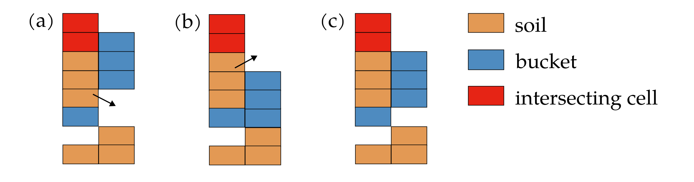

# Documentation for intersecting_cells.jl

## Introductory remarks
After updating the position of the bucket and the soil resting on the bucket, it is possible that some soil cells are located in the same position as a bucket wall, while it is obviously physically impossible to have both soil and the bucket at the same position.
These soil cells are referred to as intersecting cells in the simulator.

The purpose of the functions in this file is to move these soil cells following a set of rules to ensure a physically valid simulation.
The process involves two main steps: moving intersecting cells resting on the bucket and moving intersecting cells from the terrain.
The order of these steps is crucial, as the movement of intersecting cells resting on the bucket can create new intersecting cells in the terrain.

### Movement of soil cells on the bucket intersecting with the bucket
#### General description

This step focuses on relocating intersecting soil cells that are resting on the bucket.
The process involves selecting randomly one of the eight directions surrounding the intersecting cells and investigating whether the soil can be moved in that direction.
The algorithm explores positions incrementally farther from the intersecting cells until all the soil has been moved or a bucket wall blocks the movement.
If a bucket wall blocks the movement, another direction is selected for investigation.
In rare cases where not all soil can be moved after exploring all eight directions, a warning is issued, and the excess soil simply disappears.
However, this edge case should not occur in normal scenarios.

Note: 
- The investigated directions are randomized in order to avoid asymmetrical results.
- There are necessarily two bucket layers where the intersecting soil cells are located.

#### Description of the different cases
##### No bucket is present
In this case, the intersecting soil cells are simply moved to the terrain.

##### One bucket layer
Three different cases are possible, as illustrated in the vertical slice diagram below:



(a) In this case, there is an open space below the bucket layer, and the remaining intersecting soil cells are moved to the terrain.
This movement is independent of the available space below the bucket.
If there is insufficient space, the soil is still moved, and the newly created intersecting soil cells will be addressed in the subsequent step.

(b) In this case, the remaining intersecting soil cells are moved to the top of the bucket layer.
This movement is independent of whether soil is present on this bucket layer.

(c) In this case, the bucket layer in the new position extends over the two bucket layers from the previous position, creating a wall that prevents soil movement.
The exploration in this direction is therefore halted.

Note that in this case the investigation of the considered direction will necessarily stop, either because of the presence of a bucket wall or because all the soil could be moved.
That also means that the previous position has necessarily two bucket layers.

##### Two bucket layers
Four different cases are possible, as illustrated in the vertical slice diagram below:


(a) In this case, the soil fully fills the space between the two bucket layers in the new position.
No soil is moved to this position, but the exploration in this direction can continue.

(b) In this case, some space is available between the two bucket layers.
The intersecting cells are moved to the available space, and the exploration in this direction continues.

(c) In this case, the combination of the bucket soil and the bottom bucket layer in the new position extends over the two bucket layers from the previous position.
The intersecting cells are still moved to the available space, and the exploration in this direction continues.

(d) In this case, enough space is available between the two bucket layers to accommodate all the intersecting soil cells.
The remaining intersecting cells are moved to this position.

### Movement of soil cells on the terrain intersecting with the bucket
#### General description
This step focuses on relocating intersecting soil cells that are present in the terrain and intersect with the bucket.
The algorithm investigates the eight cells surrounding the intersecting cells in a randomized order to determine if soil can be moved to those positions.
If there is insufficient space for all the soil, the algorithm incrementally explores the eight directions farther from the intersecting soil column until all the soil has been relocated.

Note:
- The investigated directions are randomized in order to avoid asymmetrical results.
- Soil is necessarily moved to the terrain.
  The digging is therefore a two-step process.
  Intersecting cells are first moved to the terrain just outside the bucket, then avalanche on the bucket during the relaxation step.

#### Description of the different cases
Three different cases are possible, as illustrated in the vertical slice diagram below:


(a) In this case, no bucket is present in the new position, and all the soil is moved to that position.
This is done regardless of whether the bucket is buried deep underground.

(b) In this case, no space is available below the bucket, so no movement is made.

(c) In this case, some space is available below the bucket, and soil is moved to that position to fill the gap.

### Concluding remarks

When the simulator would have the ability to handle multiple buckets, it may be necessary to handle the movement of soil resting on a bucket that intersects with a different bucket separately.
Additionally, the case where a different bucket blocks the movement of soil to the terrain would need to be addressed.

## API
```@autodocs
Modules = [SoilDynamics]
Pages   = ["intersecting_cells.jl"]
```
